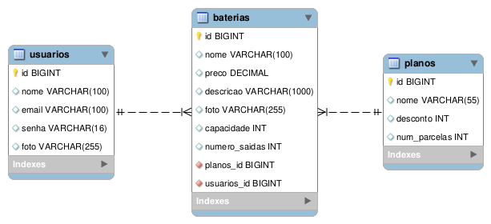

# PowerGreen<br> [](https://github.com/wagnermor/PowerGreen_BackEnd/blob/main/LICENSE) 
**PowerGreen**<br>*Energia limpa em moviento*
# Sobre o projeto

[https://powerGreen.com.br](https://github.com/wagnermor/PowerGreen_BackEnd "Projeto powerGreen")
PowerGreen é uma aplicação full stack, web e mobile, construída como projeto integrador durante o bootcamp **JAVA FullStack** oferecido por [Generation](https://brazil.generation.org "Site da Generation") e [Zé Delivery](https://www.ze.delivery "Site do Zé Delivery").

A aplicação consiste em um e-commerce para locação de bateria recaregável (powerbank) para veículos elétricos, onde é feito o cadastro e login do usuário e depois de logado, são listadas as baterias disponíveis para locação.


## Fluxo do usuário 


## DER - Diagrama Entidade Relacionamento


# Tecnologias utilizadas
## Back end &nbsp; 

- Java
- Spring Boot
- JPA / Hibernate
- Maven

## Implantação em produção
- Back end: 
- Banco de dados: MySQL

# Como executar o projeto

## Back end
Pré-requisitos: Java 17<

```bash
# clonar repositório
git clone https://github.com/wagnermor/PowerGreen_BackEnd

# entrar na pasta do projeto back end
cd powerGreen

# executar o projeto
./mvnw spring-boot:run
```
# Colaboradores

| [<br>Wagner Moreira<br>](https://github.com/wagnermor) | [<br>Marlon Bassoto<br>](https://github.com/Killbazz) | [<br>Joel Jr.<br>](https://github.com/Joeljrbeginner) | [<br>Carol Bertulli<br>](https://github.com/CarolBertulli) |
|:---:|:---:|:---:|:---:|
| [<br>Jessica Cavalcante<br>](https://github.com/jess59cavalcante) | [<br>Gustavo Henrique<br>](https://github.com/Jotapppe) | [<br>Henrique Vieira<br>](https://github.com/HenriqueFerreirav) |  |
